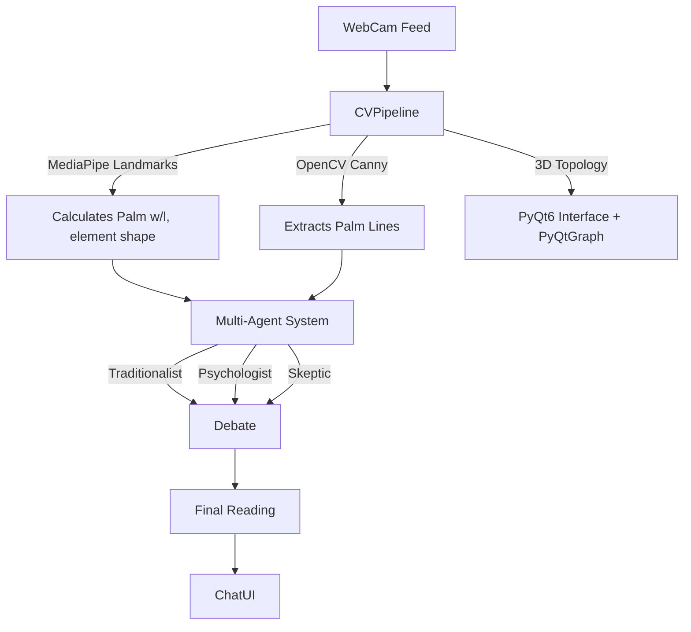

# 🔮 Palm-Astrology: Enterprise Palmistry AI

[](https://github.com/InezTech/Palm-Astrology/actions)
[](https://python.org)
[](https://opensource.org/licenses/MIT)

An advanced, privacy-first computer vision and generative AI pipeline for real-time palmistry assessment. This application bridges **deterministic machine learning calculations** with **multimodal large language models (Vision LLMs)** and a **Multi-Agent Synthesizer System** to generate highly clinical, professional consulting reports.

---

## ⚡ Core Architecture

This project is built using a clean MVC (Model-View-Controller) architecture, decoupling the UI from the heavy CV/AI processing pipelines. 



## 🔥 Technical Highlights (The "Wow" Factor)

### 1. Multi-Agent Debate System
Leverages a multi-agent AI architecture where three distinct personas (The Traditionalist, The Psychologist, and The Skeptic) analyze the extracted hand biometrics simultaneously. Their insights are debated and then compiled by a "Synthesizer" AI to provide a highly nuanced, robust, and professional reading.

### 2. Live 3D Topology Mapping
Integrates `pyqtgraph` and OpenGL to render an interactive, real-time 3D wireframe mesh of the user's hand, enhancing the visual experience and demonstrating advanced data visualization capabilities.

### 3. Advanced On-Device Computer Vision
We don't just send images to an API. The `CVPipeline` performs real-time data extraction at 30 FPS:
*   **Dimensional Analysis:** Uses `MediaPipe` landmarks to mathematically calculate the ratio of palm width, palm length, and finger length. It uses deterministic heuristics to identify the user's "elemental hand shape" (Earth, Air, Fire, Water).
*   **Canny Edge Extraction:** Implements an OpenCV pipeline with Gaussian blurring and Canny edge detection, masked dynamically *only* to the region of the palm.

### 4. Professional Export System
Users can export their comprehensive, synthesized multi-agent readings into beautifully formatted PDF reports using `ReportLab`, ideal for enterprise or clinical consulting environments.

---

## 🛠️ Technical Challenges Overcome

*   **Jitter in Real-time Processing:** Passing raw `MediaPipe` landmarks into the UI thread caused serious flickering. This was solved by separating the CV pipeline state from the PyQt `QTimer` UI loop, ensuring smooth 30FPS AR overlays and 3D rendering.
*   **Multimodal Synthesis & Prompt Leaking:** Sending a high-res image to an LLM often results in generic responses. By pre-calculating the mathematical ratios and routing them through a multi-agent debate, the system grounds the model in hard deterministic data, eliminating AI hallucinations and ensuring clinical precision.

## 🚀 Quick Start Setup

1. **Clone and Install:**
```bash
git clone https://github.com/InezTech/Palm-Astrology.git
cd Palm-Astrology
python3 -m venv venv
source venv/bin/activate
pip install -r requirements.txt
```

2. **Configure Environment:**
Create a `.env` file (or use the in-app Settings UI) to add your API keys. Make sure your `CAMERA_INDEX` is set correctly for your setup.

3. **Launch the Application:**
```bash
export PYTHONPATH=.
python app.py
```
